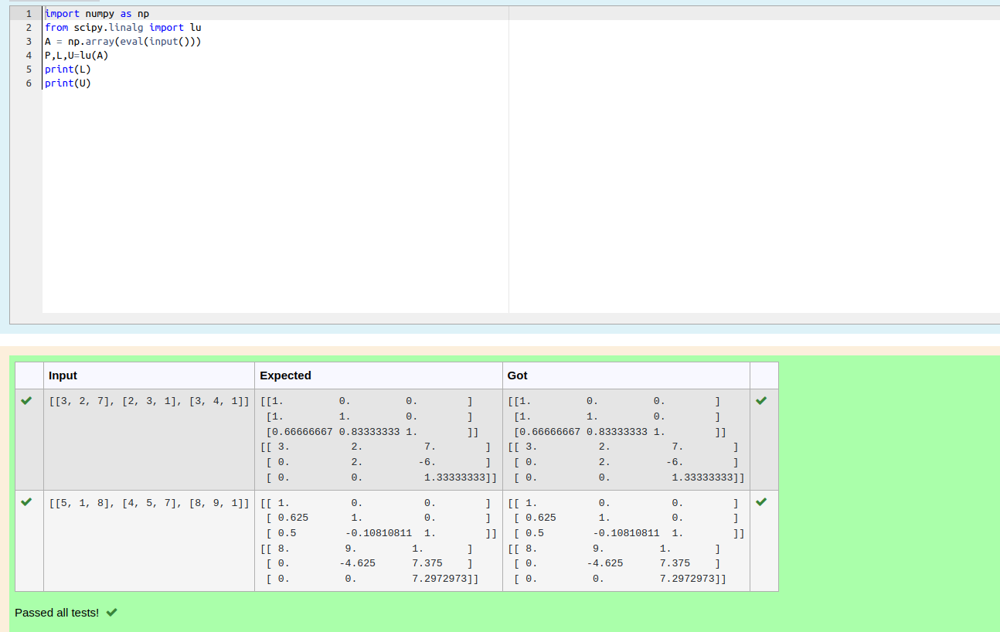
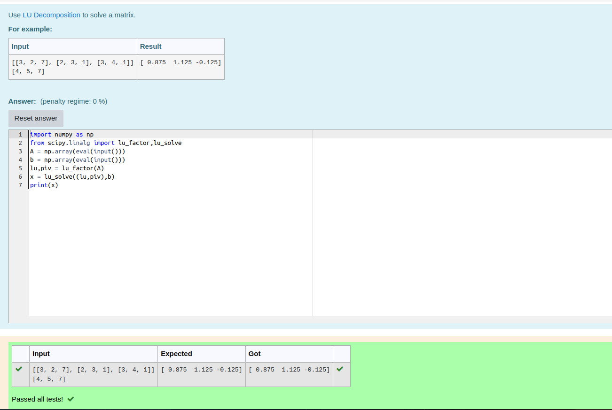

# LU Decomposition 

## AIM:
To write a program to find the LU Decomposition of a matrix.

## Equipments Required:
1. Hardware – PCs
2. Anaconda – Python 3.7 Installation / Moodle-Code Runner

## Algorithm
1. Import the numpy module to use the built in function for calculations.
2. Assign in np.array
3. Using the np.linalg.solve(), we can find the solution
4. End the program and display the result using print statement.

## Program:
(i) To find the L and U matrix
```
Program to find the L and U matrix.
Developed by: Charumathi R
RegisterNumber: 22006878
import numpy as np
from scipy.linalg import lu
A = np.array(eval(input()))
P,L,U=lu(A)
print(L)
print(U)

```
(ii) To find the LU Decomposition of a matrix
```

Program to find the LU Decomposition of a matrix.
Developed by: Charumathi R
RegisterNumber: 22006878

import numpy as np
from scipy.linalg import lu_factor,lu_solve
A = np.array(eval(input()))
b = np.array(eval(input()))
lu,piv = lu_factor(A)
x = lu_solve((lu,piv),b)
print(x)

```

## Output:




## Result:
Thus the program to find the LU Decomposition of a matrix is written and verified using python programming.

